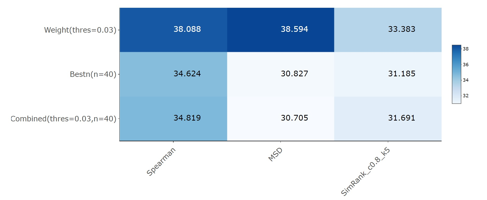
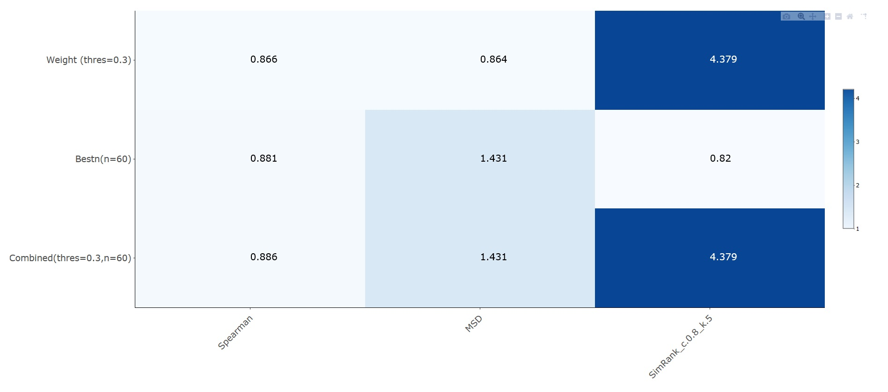

# Project 4: Collaborative Filtering

### [Project Description](doc/project4_desc.md)

Term: Spring 2018

+ Team # 6
+ Projec title: Collaborative Filtering Algorithm
+ Team members
	+ team member: Chandak, Anshuma ac4258@columbia.edu
	+ team member: He, Shan sh3667@columbia.edu
	+ team member: Li, Hongyu hl3099@columbia.edu
	+ team member: Liu, Shiyu sl4258@columbia.edu
	+ team member: Zhang, Junkai jz2929@columbia.edu
	
+ Presenter: Zhang, Junkai

+ Project summary: 

For this project, we are given two algorithms to perform collaborative filtering, and they are -  Memory-based Algorithm and Model-based Algorithm. With respect to the data sets, we have the Microsoft Web Dataset and  EachMovie Dataset. We applied three similarity weights - **Spearman Correlation , Mean squared difference, SimRank** and three methods of selecting neighbours - **Weight Threshold, Best-n-predictor, Combined** as part of memory based algorithm on both datasets, in order to make predictions. For model based algorithm, we made use of **Clustering Modeling**.  After having all the predictions, we finally evaluated each algorithm by Rank Score (for MS Data) & Mean Absolute Error (for EachMovie data). The following are the results of our analysis:  
  
    Here is what we do on each of the two datasets:

      Dataset 1 (Microsoft Web Dataset): 
    
        Memory-based Algorithm:
     
         Similarity Weight: Spearman Correlation, Mean-square-difference, SimRank
      
         Selecting Neighbours: Weight Threshold, Best-n-estimator, Combined
      
      Dataset 2 (Each Movie Dataset): 
      
        Memory-based Algorithm:
      
         Similarity Weight: Spearman Correlation, Mean-square-difference
      
         Selecting Neighbours: Weight Threshold, Best-n-estimator, Combined
      
        Model-based Algorithm: Cluster Models
        

      Then, here are our results for Memory-based Algorithm: ([MS dataset](http://www.columbia.edu/~hl3099/ms_heatmap.html) and [Movie dataset](http://www.columbia.edu/~hl3099/movie_heatmap.html))
    

      

      
      Here is the result for Model-based Algorithm:

      The MAE evaluation is 1.44.
	

The report of entire project with the detailed analysis and explaination are shown in the main.rmd file of the doc folder.


**Contribution statement**: ([default](doc/a_note_on_contributions.md)) All team members contributed equally in all stages of this project. All team members approve our work presented in this GitHub repository including this contributions statement. The following is the details about what each mumber did. 

1. Chandak, Anshuma : Wrote the MAE function and helped with the entire Model-based Algorithm, the application of prediction function, and edited the ReadMe file.

2. He, Shan : Wrote the Spearman function and ran the procedure of Movie evaluation on both the similarity weights, and wrote the ReadMe and main files. 

3. Li, Hongyu : Wrote the prediction and find neighbors functions, helped with the entire procedure of Model-based Algorithm and ran the process of MS evaluation and Movie evaluation.

4. Liu, Shiyu : Wrote the entire Model-based Algorithm, the transformation of Movie data and the Mean-square-difference similirity function, and also ran the evaluation of the Model-based Algorithm.

5. Zhang, Junkai : Wrote the transformation of Microsoft Web data, the SimRank function and ran the procedure of SimRank evaluation, and also made the powerpoint.

References: 
+ [Empirical analysis of predictive algorithms for collaborative filtering](doc/Paper_1_MS.pdf)
+ [An Algorithmic Framework for performing collborative filtering](doc/Paper_2_Movie.pdf)
+ [SimRank: A Measure of Structural-Context Similarity](doc/SimRank.pdf)
+ [An Experimental Evaluation of SimRank-based Similarity Search Algorithms](doc/SimRank_Paper2.pdf)

Following [suggestions](http://nicercode.github.io/blog/2013-04-05-projects/) by [RICH FITZJOHN](http://nicercode.github.io/about/#Team) (@richfitz). This folder is orgarnized as follows.

```
proj/
|--lib/
|-- data/
|-- doc/
|-- figs/
|-- output/
```

Please see each subfolder for a README file.
